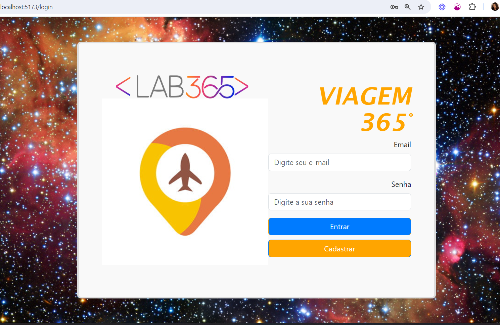
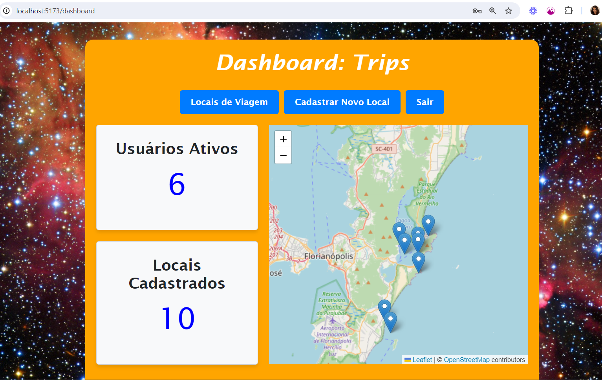
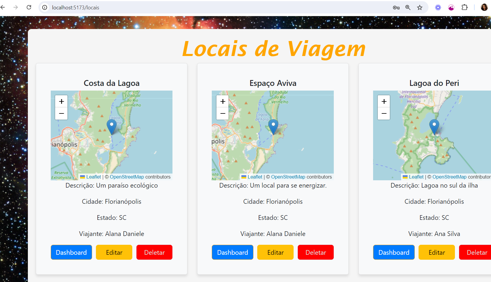
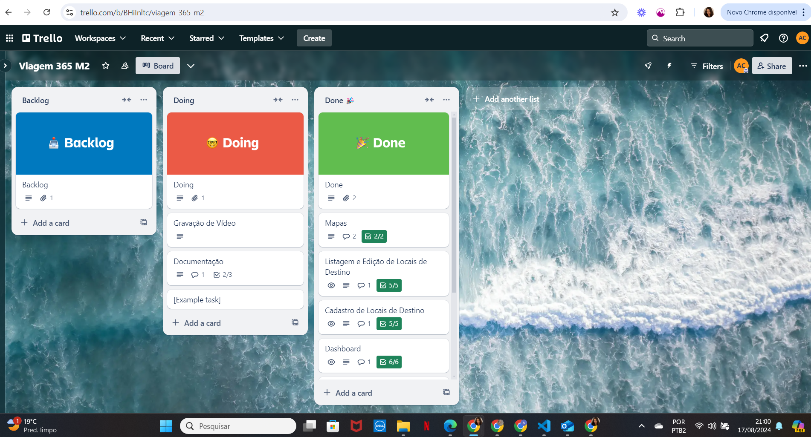

# Viagem365
<p aligne="center">


</p>

## Descrição do Projeto

Viagem365 é uma aplicação web para gerenciamento de viagens, permitindo aos usuários cadastrar, listar, editar e visualizar locais de destino em um mapa interativo.

## Funcionalidades

- **Login e Cadastro:** Autenticação de usuários.
- **Dashboard:** Exibição de informações principais e navegação.
- **Cadastro de Locais de Destino:** Adicionar novos destinos.
- **Listagem e Edição:** Listar, editar e deletar destinos.
- **Mapas:** Visualização de destinos cadastrados em um mapa.

## Telas

<p aligne="center">
    <strong>Login</strong><br/>
    
</p>
<p aligne="center">
    <strong>Dashboard</strong><br/>
    
</p>
<p aligne="center">
    <strong>Locais</strong><br/>
    
</p>


## Tecnologias Utilizadas

- **Planejamento:** Trello
- **Frontend:** React
- **Componentes de UI:** Bootstrap
- **Formulários:** react-hook-form
- **Roteamento:** react-router-dom
- **API e Backend:** json-server para prototipagem rápida de API
- **Mapas:** Leaflet
- **Busca de Endereços:** API ViaCEP

## Como Executar

### Passos para clonar o repositório e rodar a aplicação localmente:

1. Clone o repositório:
    ```bash
    git clone https://github.com/a-natureza/Viagem-365.git
    cd viagem-365
    ```

2. Instale as dependências:
    ```bash
    npm install
    ```

3. Inicie o servidor JSON (para prototipagem rápida de API):
    ```bash
    npx json-server --watch database.json --port 3000
    ```

4. Inicie a aplicação:
    ```bash
    npm run dev
    ```

5. Abra o navegador e acesse:
    ```
    http://localhost:5173
    ```

## Melhorias Futuras

- Back-end.
- Integração com banco de dados.
- Criptografia.
- Serviços de API no diretório services.
- Implementar autenticação robusta com JWT.
- Adicionar testes unitários e de integração.
- Melhorar a UI com mais funcionalidades interativas.
- Otimizar o desempenho da aplicação.
- Permitir postagem de fotos dos locais.
- Chat para usuários ativos.
- Header, Footer e Siderbar.

## Vídeo de Apresentação
<!-- 
[](https://www.youtube.com/watch?v=seu-video-id) -->

## Estrutura do Projeto

- **src/**
  - **components/**: Componentes reutilizáveis.
  - **pages/**: Páginas principais (Login, Dashboard, etc).
  - **routes/**: Rotas de navegação.
  - **assets/**: Imagens utilizadas.
  - **database.json/**: API json server.

##  PLANO DE PROJETO
Ao construir a aplicação coloquei em prática os aprendizados em:


   - **Versionamento**: Uso do GitHub para versionamento de código.
   - **HTML**: Tags e Elementos semânticos
   - **CSS**: Seletores, Principais estilos, Layouts e Flexbox
   - **JavaScript**: Variáveis, Tipos de dados, Operadores, Manipulação do DOM, Estrutura de Controle de Fluxo, Funções, Eventos, JSON, LocalStorage, Interval, Timeout, Operadores Rest e Spread, Módulos, Arrow Functions, Funções de Arrays, Funções Assíncronas e Fetch.
   - **React**: Renderização de componentes, Props, Proptypes, Hooks, Eventos, Renderização de listas, React Router, Formulários, Prop Drilling, Composition, Estilos Bootstrap, Developer Tools e Deploy.
   - **Skills**: Organização, criação de documentação e apresentação de solução.

## 👩‍💻 Expert

<p>
    
    <p>&nbsp&nbsp&nbspAlana Daniele<br>
    &nbsp&nbsp&nbsp
    <a 
        href="https://github.com/a-natureza/"
        target="_blank">
        GitHub
    </a>
    &nbsp;|&nbsp;
    <a 
        href="https://www.linkedin.com/in/alana-daniele/"
        target="_blank">
        LinkedIn
    </a>
    &nbsp;|&nbsp;
    <a 
        href="https://www.instagram.com/tendanapraia/"
        target="_blank">
        Instagram
    </a>
    &nbsp;|&nbsp;</p>
</p>
<br/><br/>
<p>

---

⌨️ com 💜 por [Alana Daniele](https://github.com/a-natureza)